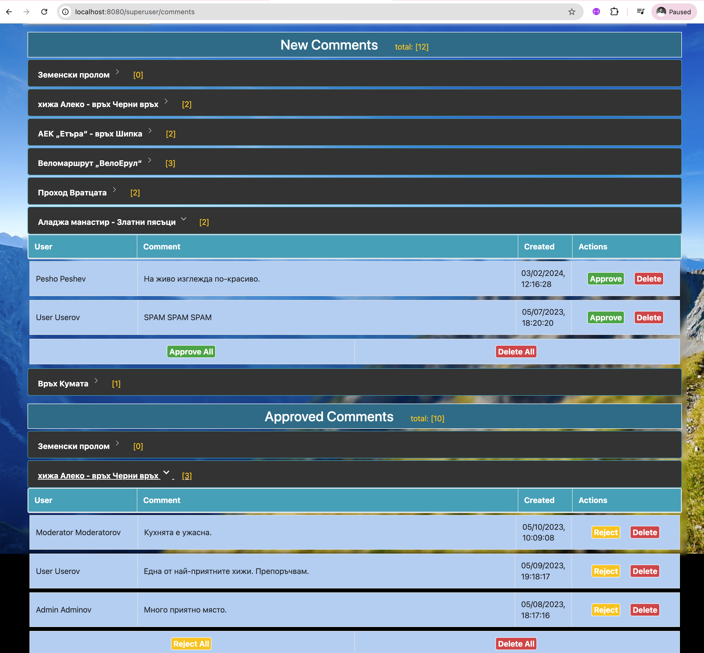

# Pathfinder

## Project Setup Guide
This guide will help you set up and run the Pathfinder project locally.

## Prerequisites

Make sure you have the following installed:
- Git
- Docker Desktop (with Docker Compose)
- Java JDK (version 17 or higher recommended)
- Gradle (can also use Gradle wrapper included in project)
## 1. Clone the Repository
`git clone https://github.com/andy489/Pathfinder.git`
## 2. Navigate to Project Directory
`cd Pathfinder`
## 3. Configure Environment Variables
```env
# Database credentials
DB_NAME=pathfinder
DB_USER=admin
DB_PASS=1234
DB_ROOT_PASS=1234
DB_PORT=3306
# Spring Boot app properties
REMEMBER_ME_KEY=1234
# Cloudinary credentials
CLOUD_NAME=
CLOUD_API_KEY=
CLOUD_API_SECRET=
```
## 4. Start Docker Services
`docker-compose up -d`
This command will start all required services (database) in the background.
## 5. Verify Database is Running
`docker-compose ps`
## 6. Run the Application
`./gradlew bootRun`

## Database Connection Details
Your application and database tools (like Sequel Ace) can connect using:

- Host: `127.0.0.1` or `localhost`
- Port: `3306`
- Username: `admin`
- Password: `1234`
- Database: `pathfinder`

## Managing Services
- Stop everything: `docker-compose down`
- View database logs: `docker-compose logs mysql`


## Home Page
<div style="text-align: center; width: 720px;">
  
</div>

## Route Details
<div style="text-align: center; width: 720px;">
  
</div>

## All Routes
<div style="text-align: center; width: 720px;">
  
</div>

## Admin Panel: Comments Management
<div style="text-align: center; width: 720px;">
  
</div>

## Admin Panel: Permissions (Roles) Management
<div style="text-align: center; width: 720px;">
  
</div>
