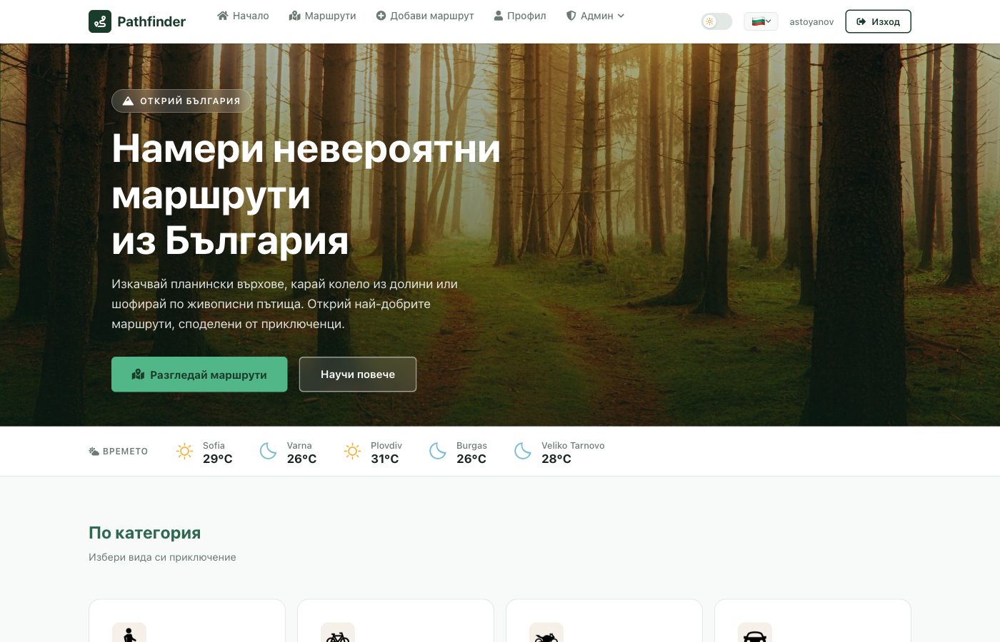
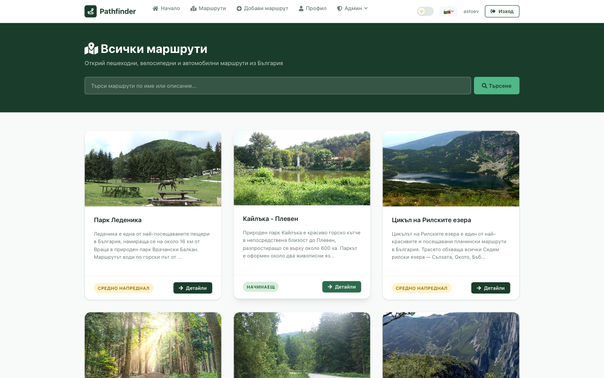
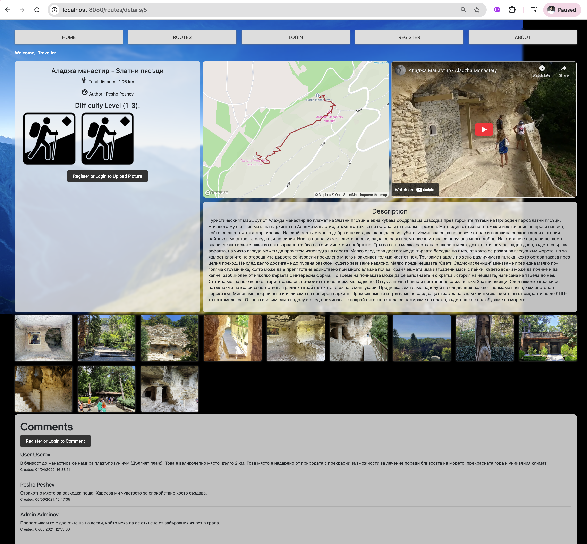
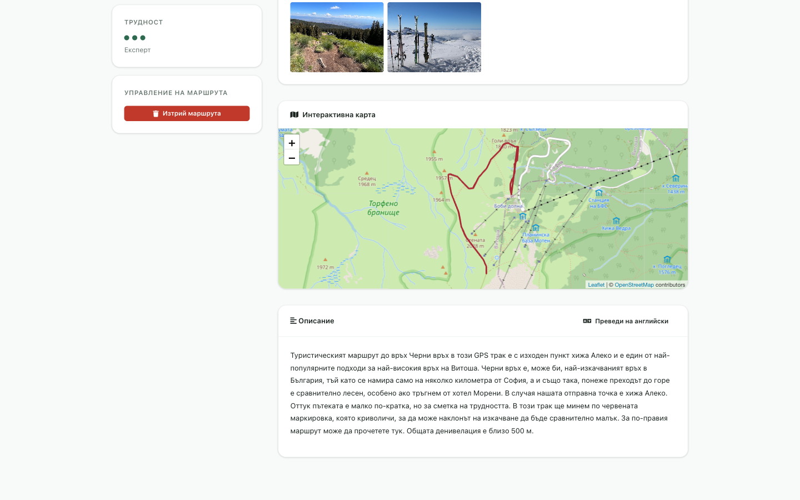
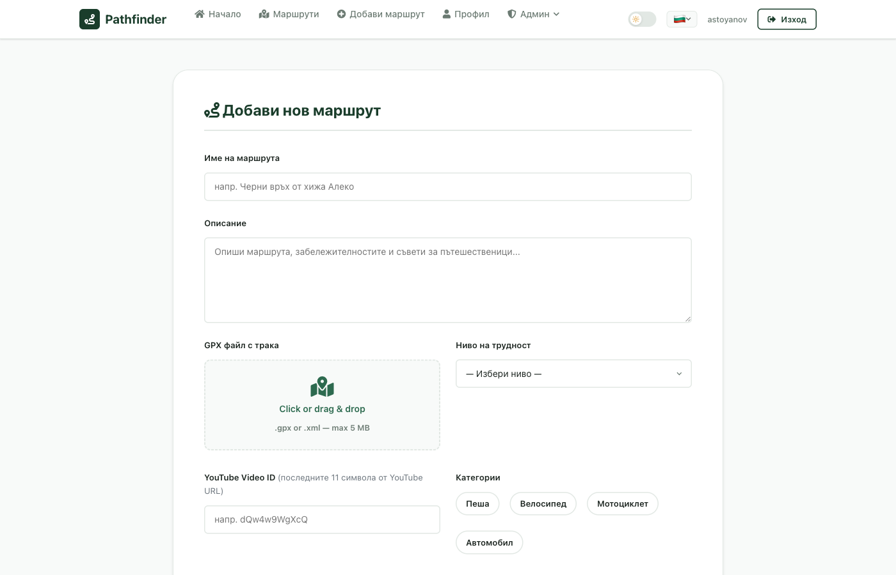
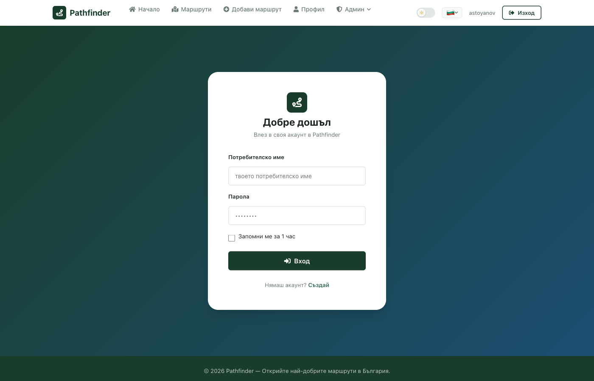
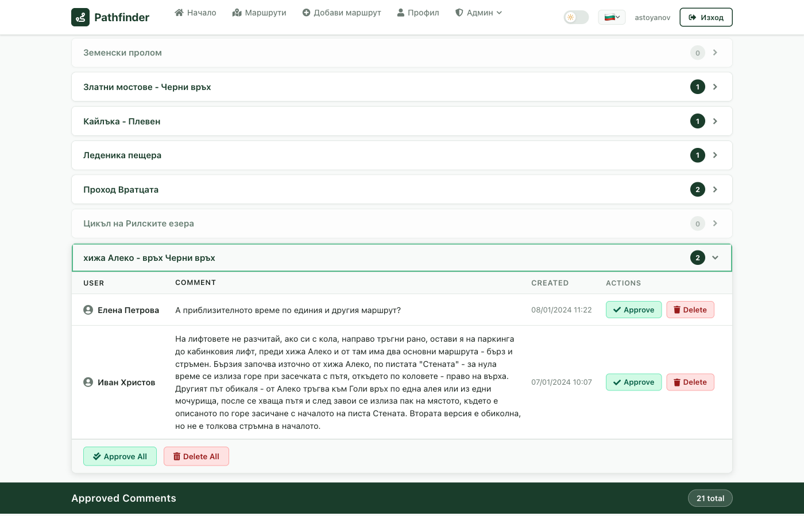
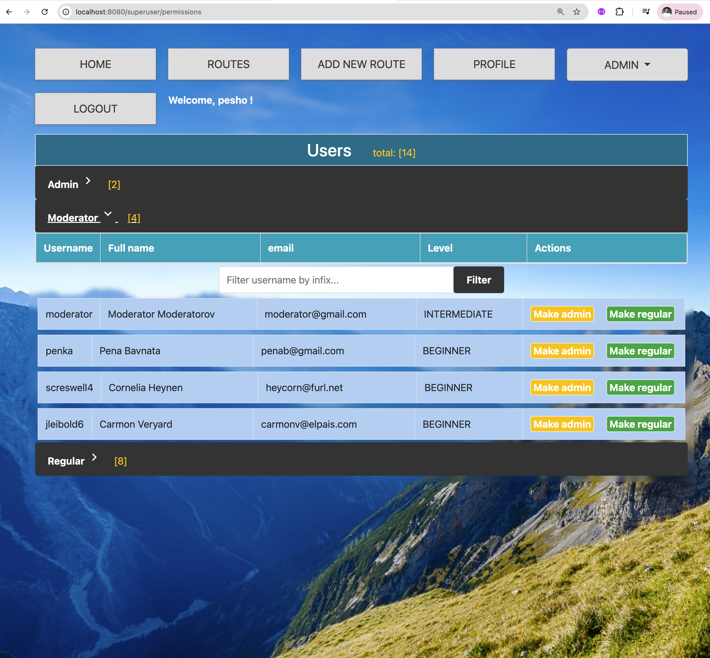

# Pathfinder

A Spring Boot web application for sharing and discovering hiking, cycling, and driving routes in Bulgaria. Users browse routes with interactive GPX maps, watch embedded YouTube clips, view Cloudinary-hosted photo galleries, and leave comments. Admins and moderators manage comments and user roles through a dedicated superuser panel.

---

## Screenshots

### Home Page


### All Routes


### Route Details — Interactive Map, Photos & Comments


### Route Details — Expert view (хижа Алеко → Черни връх)


### Add Route


### Login


### Admin Panel — Comments Moderation


### Admin Panel — User Permissions


---

## Quick Start

### Prerequisites
- Git, Docker Desktop, Java 17+, Gradle (wrapper included)

### 1. Clone
```bash
git clone https://github.com/andy489/Pathfinder.git
cd Pathfinder
```

### 2. Configure `.env`
```env
DB_NAME=pathfinder
DB_USER=admin
DB_PASS=1234
DB_ROOT_PASS=1234
DB_PORT=3306
REMEMBER_ME_KEY=some-secret
CLOUD_NAME=
CLOUD_API_KEY=
CLOUD_API_SECRET=
SPRING_PROFILES_ACTIVE=dev
```

> `SPRING_PROFILES_ACTIVE=dev` activates `application-dev.yml`, which adds `useSSL=false&allowPublicKeyRetrieval=true` to the JDBC URL for the local MySQL Docker container. Never set this in production.  
> Cloudinary credentials are only needed for picture upload; the rest of the app works without them.

### 3. Start the Database
```bash
docker-compose up -d        # starts MySQL only
```

### 4. Run
```bash
./gradlew bootRun           # http://localhost:8080
```

### Run the full stack in Docker
```bash
docker-compose --profile full up -d        # MySQL + app (uses Dockerfile)
```

### Other Commands
```bash
./gradlew test              # run all tests
./gradlew build             # build jar
docker-compose down         # stop containers
```

---

## Core Functionalities

### Route Management
- Users can **add routes** via a form that accepts a name, description, difficulty level, category (Pedestrian / Bicycle / Motorcycle / Car), a GPX track file, and an optional YouTube video ID.
- GPX files are stored on disk (`src/main/resources/gpx/`). The filename is saved in the DB; coordinates are served at `GET /api/routes/coordinates/{id}` and rendered as an interactive polyline by **Leaflet.js + OpenStreetMap** (no API key needed).
- The map view shows total track distance (Haversine), and auto-fits the viewport to the track bounds.
- Only the route **author** or an **ADMIN** can delete a route.

### Photo Gallery
- Authenticated users can upload photos for any route. Images are uploaded to **Cloudinary**; only the resulting URL is stored in the DB.
- The route details page renders all pictures in a responsive gallery grid.

### Comments
- Any authenticated user can post a comment on a route.
- Comments are **unapproved by default** and hidden from the public until a moderator or admin approves them via the superuser panel.
- The REST endpoint `GET /api/{routeId}/comments` returns only approved comments to the frontend.

### Internationalisation (i18n)
- UI labels are served from Spring MVC message bundles (`messages_XX.properties`), switchable via a language toggle in the nav bar. Supported: 🇧🇬 Bulgarian, 🇬🇧 English.
- Route content (names, descriptions) is stored in **Bulgarian**. When a visitor switches to English, the **server** translates the name and description before rendering the page — no JavaScript async delay.
- Comments are translated on demand via a "Translate" button, which calls `POST /api/translate`.
- When a user **adds a route** in English, `RouteService` auto-detects the language (Cyrillic ratio heuristic) and translates the text to Bulgarian before saving, keeping the DB consistently in Bulgarian.
- **Translation backend** (waterfall — first success wins):
  1. **Google Translate** unofficial endpoint — no API key, no Docker required, fast and reliable.
  2. **LibreTranslate** — self-hosted Docker container (optional, start with `--profile translate`).
  3. **MyMemory** free API — last resort, 500-char limit per request.
  - Results are cached in-memory per route+language; repeat visits are instant.

### Superuser Panel
| Page | URL | Who |
|------|-----|-----|
| Comments Moderation | `/superuser/comments` | ADMIN, MODERATOR |
| User Permissions | `/superuser/permissions` | ADMIN only |

- **Comments** panel: approve / reject / delete individual comments or all comments for a route in one click, with live counter updates (no page reload).
- **Permissions** panel: move users between ADMIN / MODERATOR / REGULAR roles. The current admin cannot demote themselves (shown as a locked "Self" badge).

### Security
- Spring Security 6; remember-me token validity: **1 hour** (configurable via `REMEMBER_ME_KEY`)
- Unauthenticated users can browse routes and read approved comments; all write actions require login
- CSRF protection enabled; tokens injected via `<meta>` tags and read by JS fetch calls

---

## Database Schema

All schema and seed data is managed by **Liquibase** (`ddl-auto: none`). Master changelog: `src/main/resources/changelog-master.xml` → `db/changelog/changelog-v1.0.xml`. Never edit existing changesets — always append new ones with the next sequential ID.

### Entity-Relationship Overview

```
┌─────────┐       ┌─────────────┐       ┌────────────┐
│  users  │──────<│ users_roles │>──────│   roles    │
│         │       └─────────────┘       │ REGULAR    │
│ id (PK) │                             │ MODERATOR  │
│ username│       ┌──────────┐          │ ADMIN      │
│ email   │──────<│ messages │          └────────────┘
│ password│  auth │ (author) │
│ level   │       │ (recip.) │
└────┬────┘       └──────────┘
     │ author
     │                              ┌────────────────────┐
┌────▼──────┐     ┌──────────────┐  │ routes_categories  │
│  routes   │─────│   pictures   │  │ route_id  (FK)     │
│           │     │ url (Cloud.) │  │ category_id (FK)   │
│ id (PK)   │     └──────────────┘  └─────────┬──────────┘
│ name      │                                 │
│ level     │<────────────────────────────────┘
│ gpx_file  │     ┌──────────────┐  ┌────────────────────┐
│ video_url │─────│   comments   │  │    categories      │
│ author_id │     │ approved bit │  │ PEDESTRIAN         │
└───────────┘     │ created      │  │ BICYCLE            │
                  │ modified     │  │ MOTORCYCLE         │
                  └──────────────┘  │ CAR                │
                                    └────────────────────┘
```

### Tables

| Table | Description |
|-------|-------------|
| `users` | Registered users — `username`, `email`, `full_name`, `birth_date`, bcrypt `password`, skill `level` (BEGINNER / INTERMEDIATE / EXPERT) |
| `roles` | Enum values: `REGULAR`, `MODERATOR`, `ADMIN` |
| `users_roles` | Many-to-many: users ↔ roles |
| `routes` | Route records — `name`, `description`, `gpx_coordinates` (filename), `level`, `video_url` (YouTube ID), `author_id` FK |
| `categories` | `PEDESTRIAN`, `BICYCLE`, `MOTORCYCLE`, `CAR` — each with an optional description |
| `routes_categories` | Many-to-many: routes ↔ categories |
| `comments` | User comments — `comment` text, `created`/`modified` timestamps, `approved` bit, `author_id` FK, `route_id` FK |
| `pictures` | Image records — `title`, Cloudinary `url`, `author_id` FK, `route_id` FK |
| `messages` | Direct messages — `text`, `date_time`, `author_id` FK, `recipient_id` FK |

### Key Foreign-Key Relationships

```
users  1──*  routes        (author_id)
users  1──*  comments      (author_id)
users  1──*  pictures      (author_id)
users  1──*  messages      (author_id, recipient_id)
routes 1──*  comments      (route_id)
routes 1──*  pictures      (route_id)
routes *──*  categories    (via routes_categories)
users  *──*  roles         (via users_roles)
```

---

## Architecture

### Stack
| Layer | Technology |
|-------|-----------|
| Backend | Spring Boot 3.3 · Java 17 · Spring Security 6 · Spring Data JPA (Hibernate) |
| Database | MySQL 8 in Docker · Liquibase migrations |
| Templates | Thymeleaf + Thymeleaf Security extras |
| Maps | Leaflet.js + OpenStreetMap · GPX parsed by `io.jenetics.jpx` |
| Images | Cloudinary SDK (upload) · URLs stored in DB |
| Frontend | Bootstrap 4 · Vanilla JS (fetch API, CSRF headers) |
| Build | Gradle |

### Package Layout
```
web/              Thymeleaf MVC controllers (extend GenericController)
web/rest/         REST endpoints under /api/**
service/          Business logic; orchestrates repos + MapStructMapper
repository/       Spring Data JPA interfaces
model/entity/     JPA entities (extend GenericEntity — Long id)
model/dto/        Form-binding & REST request objects (Bean Validation)
model/view/       Read-only projections returned to templates / REST
model/validation/ Custom constraints (@UniqueUsername, @MinAge, @CustomFile)
mapper/           Single MapStruct interface for all conversions
config/           Security, Cloudinary, exception handlers
```

### Key Data Flows

**Add route**
1. `RouteController` receives `RouteAddDto` (multipart form + GPX file)
2. `RouteService.addRoute()` maps DTO → `RouteEntity` via `MapStructMapper`; writes GPX to `src/main/resources/gpx/`; stores only the filename in `gpxCoordinates`

**Map rendering**
1. `RouteRestController` serves `GET /api/routes/coordinates/{id}` — parses GPX, returns `{ coordinates, zoom, bounds }`
2. `map.js` (Leaflet) fetches the endpoint, draws the polyline, calculates distance via Haversine

**Comment moderation**
1. User POSTs comment → saved with `approved = false`
2. Admin/moderator visits `/superuser/comments` → PATCH or DELETE via REST (`/superuser/comments/{id}`)
3. JS updates counters and moves rows between sections without page reload
4. `GET /api/{routeId}/comments` only returns `approved = true` rows to the public frontend

---

## Seed Data

### Users

| Username | Full Name | Roles | Level | Password |
|----------|-----------|-------|-------|----------|
| `astoyanov` | Александър Стоянов | ADMIN · MODERATOR · REGULAR | EXPERT | `1234` |
| `moderator` | Moderator Moderatorov | MODERATOR · REGULAR | INTERMEDIATE | `1234` |
| `pesho` | Пешо Пешев | ADMIN · REGULAR | BEGINNER | `1234` |
| `mgeorgiev` | Мартин Георгиев | REGULAR | BEGINNER | `1234` |
| `ivanhristov` | Иван Христов | REGULAR | INTERMEDIATE | `1234` |
| `epetrova` | Елена Петрова | MODERATOR | BEGINNER | — |
| `dkolev` | Димитър Колев | REGULAR | INTERMEDIATE | — |
| *(+ 7 more regular/moderator users)* | | | | |

> **Superuser access**: log in as `astoyanov` / `1234` or `pesho` / `1234` to access `/superuser/comments` and `/superuser/permissions`.

#### What you can do locally with each account

| Account | Password | What you can do |
|---------|----------|-----------------|
| `astoyanov` | `1234` | Full admin: add routes, delete **any** route, approve/delete **any** comment, manage user roles. Cannot demote self in the permissions panel. |
| `pesho` | `1234` | Same admin rights as `astoyanov`. |
| `moderator` | `1234` | Approve and delete comments via `/superuser/comments`. Cannot manage user roles or delete routes authored by others. |
| `mgeorgiev` | `1234` | Regular user: add routes, delete only **own** routes, post comments (unapproved until a moderator acts). |
| `ivanhristov` | `1234` | Same as `mgeorgiev`. |

**Route deletion rules**: only the route's author or an ADMIN can delete a route. Attempting to delete another user's route as a regular user will result in an error.

**Comment moderation**: all comments are saved as unapproved and hidden from the public until a MODERATOR or ADMIN approves them at `/superuser/comments`.

**Picture upload**: requires valid Cloudinary credentials in `.env` (`CLOUD_NAME`, `CLOUD_API_KEY`, `CLOUD_API_SECRET`). The rest of the app works without them.

### Routes

| ID | Name | Level | Categories |
|----|------|-------|-----------|
| 1 | Връх Кумата | BEGINNER | Pedestrian |
| 2 | Веломаршрут „ВелоЕрул" | INTERMEDIATE | Bicycle |
| 3 | хижа Алеко → връх Черни връх | EXPERT | Pedestrian |
| 4 | АЕК „Етъра" → връх Шипка | BEGINNER | Pedestrian |
| 5 | Аладжа манастир → Златни пясъци | INTERMEDIATE | Pedestrian |
| 6 | Земенски пролом | INTERMEDIATE | Pedestrian · Car |
| 7 | Проход Вратцата | BEGINNER | Pedestrian · Motorcycle |
| 8 | Златни мостове → Черни връх | INTERMEDIATE | Pedestrian · Bicycle |
| 11 | Кайлъка → Плевен | BEGINNER | Pedestrian · Bicycle |
| 12 | Леденика (Врачански Балкан) | INTERMEDIATE | Pedestrian |

---

## Database Connection (local dev)

| Field | Value |
|-------|-------|
| Host | `127.0.0.1` |
| Port | `3306` |
| Database | `pathfinder` |
| Username | `admin` |
| Password | `1234` |
